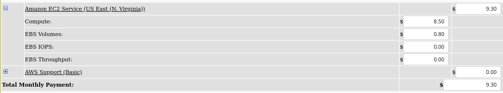

# CLD - Lab 01: Deploy web application on IaaS

> Authors: Robin Demarta & Doran Kayoumi

## Task 2; Create an Amazon EC2 instance

Time until the instance started : Give or take 20 seconds to start


Most memory : x1e.32xlarge (3904GiB)

Most CPU: x1e.32xlarge & x1.32xlarge (128)

How long did it take for the new instance to get into the *running* state?  Give or take 20 seconds


Public DNS : ec2-54-237-229-52.compute-1.amazonaws.com


Hostname: ip-172-31-16-126

uname : Linux ip-172-31-16-126 5.4.0-1038-aws #40~18.04.1-Ubuntu SMP Sat Feb 6 01:56:56 UTC 2021 x86_64 x86_64 x86_64 GNU/Linux


Pings

```bash
# Doesn't work because it's the private address
$ ping 172.31.16.126
PING 172.31.16.126 (172.31.16.126) 56(84) bytes of data.

# Doesn't work by default beacuse we didn't open the ICMP port
$ ping 54.237.229.52
PING 54.237.229.52 (54.237.229.52) 56(84) bytes of data.

# After opening ICMP port (added in security group add screen)
$ ping 54.237.229.52
64 bytes from 54.237.229.52: icmp_seq=71 ttl=46 time=90.1 ms
64 bytes from 54.237.229.52: icmp_seq=72 ttl=46 time=91.1 ms
64 bytes from 54.237.229.52: icmp_seq=73 ttl=46 time=99.0 ms
64 bytes from 54.237.229.52: icmp_seq=74 ttl=46 time=94.5 ms
64 bytes from 54.237.229.52: icmp_seq=75 ttl=46 time=90.3 ms
```

The ip address display with `ifconfig` is the private address and the one we've used above is the public one. We imagine that there some sort of magic in the background that maps the public address with the private one

## Task 3: Install a web application

Here is the Drupal page we created


Elastic IP : 34.195.212.177

**Why is it a good idea to create an Elastic IP Address for a web site (our web application)? Why is it not sufficient to hand out as URL for the web site the public DNS name of the instance?**

It's a good idea because the public DNS is attached to the public IP and it can change after restarting the instance.

## Task 4: Create an additional EBS Volume and use Snapshots

**Availability zone:**


**Available space:**

```bash
$ df -h /mnt/disk
Filesystem      Size  Used Avail Use% Mounted on
/dev/xvdf       976M  2.6M  907M   1% /mnt/disk
```

```bash
$ df -h /mnt/disk2
Filesystem      Size  Used Avail Use% Mounted on
/dev/xvdg       976M  2.6M  907M   1% /mnt/disk2
```

## Task 5: Performance analysis of your instance (optional)

### EC2 instance

System information:


Geekbench URL: https://browser.geekbench.com/geekbench3/8930300

| Performance    | Single-Core Score | Multi-Core Score |
| -------------- | ----------------- | ---------------- |
| Integer        | 2683              | 2646             |
| Floating Point | 2560              | 2563             |
| Memory         | 2771              | 2722             |

### Local machine

System information:


Geekbench URL: https://browser.geekbench.com/v5/cpu/6790981

| Performance    | Single-Core Score | Multi-Core Score |
| -------------- | ----------------- | ---------------- |
| Integer        | 612               | 1125             |
| Floating Point | 729               | 1301             |
| Memory         | -                 | -                |

> Note: We didn't find any information concerning the Memory performance for our local machine D:

### Comparison

When looking at both tables, we can clearly see that the EC2 Instance has way better performances than our local machine. We believe that this is simply because Amazon has a high end infrastructure and we have a simple laptop.

## Task 6: Resource consumption and pricing





