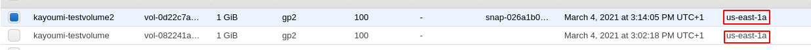

# CLD - Lab 01: Deploy web application on IaaS

> Authors: Robin Demarta & Doran Kayoumi

## Task 2; Create an Amazon EC2 instance

> What is the smallest and the biggest instance type (in terms of virtual CPUs and memory) that you can choose from when creating an instance?

Most memory: x1e.32xlarge (3904GiB)

Most CPU: x1e.32xlarge & x1.32xlarge (128)

> How long did it take for the new instance to get into the running state?

After 20 seconds, the instance got into the running state.

> From the EC2 Management Console copy the public DNS name of the instance into the report.

Public DNS : ec2-54-237-229-52.compute-1.amazonaws.com

> Once you have successfully logged into your EC2 instance, run the hostname and uname -a commands and paste their outputs into the report.

Hostname: ip-172-31-16-126

uname : Linux ip-172-31-16-126 5.4.0-1038-aws #40~18.04.1-Ubuntu SMP Sat Feb 6 01:56:56 UTC 2021 x86_64 x86_64 x86_64 GNU/Linux

> Try to ping the instance from your local machine. What do you see? Explain. Change the configuration to make it work. Ping the instance, record 5 round-trip times.

Pings

```bash
# The first ping doesn't work because it's the private address
$ ping 172.31.16.126
PING 172.31.16.126 (172.31.16.126) 56(84) bytes of data.

# Second one with the public address
# Doesn't work by default beacuse we didn't open the ICMP port
$ ping 54.237.229.52
PING 54.237.229.52 (54.237.229.52) 56(84) bytes of data.

# After opening ICMP port (added in security group add screen), ping is successful
$ ping 54.237.229.52
64 bytes from 54.237.229.52: icmp_seq=71 ttl=46 time=90.1 ms
64 bytes from 54.237.229.52: icmp_seq=72 ttl=46 time=91.1 ms
64 bytes from 54.237.229.52: icmp_seq=73 ttl=46 time=99.0 ms
64 bytes from 54.237.229.52: icmp_seq=74 ttl=46 time=94.5 ms
64 bytes from 54.237.229.52: icmp_seq=75 ttl=46 time=90.3 ms
```

> Determine the IP address seen by the operating system in the EC2 instance by running the ifconfig command. What type of address is it? Compare it to the address displayed by the ping command earlier. How do you explain that you can successfully communicate with the machine?

The ip address displayed with `ifconfig` is the private address and the one we've used above is the public one. We imagine that there some sort of magic in the background that maps the public address with the private one

**^FIXME**

## Task 3: Install a web application

> Add a screenshot of the page you created in Drupal to the report.


> Add the Elastic IP Address you created to the report.

Elastic IP : 34.195.212.177

> Why is it a good idea to create an Elastic IP Address for a web site (our web application)? Why is it not sufficient to hand out as URL for the web site the public DNS name of the instance?

It's a good idea because the public DNS is attached to the public IP and it can change after restarting the instance. In that case, the DNS name we gave out wouldn't be valid anymore. An Elastic IP solves this problem as it's static and won't change.

## Task 4: Create an additional EBS Volume and use Snapshots

**Volume's available zone:**



**Instance's available zone:**


**Available space:**

```bash
$ df -h /mnt/disk
Filesystem      Size  Used Avail Use% Mounted on
/dev/xvdf       976M  2.6M  907M   1% /mnt/disk
```

```bash
$ df -h /mnt/disk2
Filesystem      Size  Used Avail Use% Mounted on
/dev/xvdg       976M  2.6M  907M   1% /mnt/disk2
```

## Task 5: Performance analysis of your instance (optional)

### EC2 instance

System information:


Geekbench URL: https://browser.geekbench.com/geekbench3/8930300

| Performance    | Single-Core Score | Multi-Core Score |
| -------------- | ----------------- | ---------------- |
| Integer        | 2683              | 2646             |
| Floating Point | 2560              | 2563             |
| Memory         | 2771              | 2722             |

### Local machine

System information:


Geekbench URL: https://browser.geekbench.com/v5/cpu/6790981

| Performance    | Single-Core Score | Multi-Core Score |
| -------------- | ----------------- | ---------------- |
| Integer        | 612               | 1125             |
| Floating Point | 729               | 1301             |
| Memory         | -                 | -                |

> Note: We didn't find any information concerning the Memory performance for our local machine

### Comparison

When looking at both tables, we can clearly see that the EC2 Instance has way better performances than our local machine. This is because Amazon has a high end infrastructure and we have a simple laptop.

## Task 6: Resource consumption and pricing


1TB EBS of storage for one month costs 100$ and it's cheaper than buying an SSD at Digitec.

